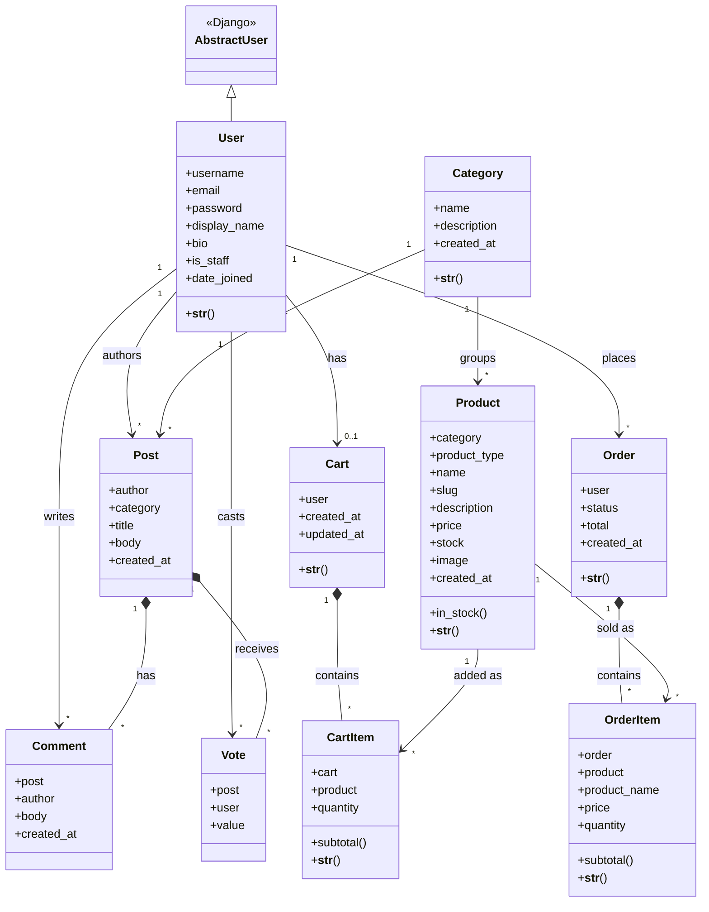

# GameHub — UML Class Diagram

Models defined in `final_project/final_app/models.py`.

```mermaid
classDiagram
    direction TB

    class AbstractUser {
        <<Django>>
    }

    class User {
        +username
        +email
        +password
        +display_name
        +bio
        +is_staff
        +date_joined
        +__str__()
    }

    class Category {
        +name
        +description
        +created_at
        +__str__()
    }

    class Post {
        +author
        +category
        +title
        +body
        +created_at
    }

    class Comment {
        +post
        +author
        +body
        +created_at
    }

    class Vote {
        +post
        +user
        +value
    }

    class Product {
        +category
        +product_type
        +name
        +slug
        +description
        +price
        +stock
        +image
        +created_at
        +in_stock()
        +__str__()
    }

    class Cart {
        +user
        +created_at
        +updated_at
        +__str__()
    }

    class CartItem {
        +cart
        +product
        +quantity
        +subtotal()
        +__str__()
    }

    class Order {
        +user
        +status
        +total
        +created_at
        +__str__()
    }

    class OrderItem {
        +order
        +product
        +product_name
        +price
        +quantity
        +subtotal()
        +__str__()
    }

    AbstractUser <|-- User

    User "1" --> "*" Post : authors
    User "1" --> "*" Comment : writes
    User "1" --> "*" Vote : casts
    User "1" --> "0..1" Cart : has
    User "1" --> "*" Order : places

    Category "1" --> "*" Post : groups
    Category "1" --> "*" Product : groups

    Post "1" *-- "*" Comment : has
    Post "1" *-- "*" Vote : receives

    Cart "1" *-- "*" CartItem : contains
    Product "1" --> "*" CartItem : added as

    Order "1" *-- "*" OrderItem : contains
    Product "1" --> "*" OrderItem : sold as
```
